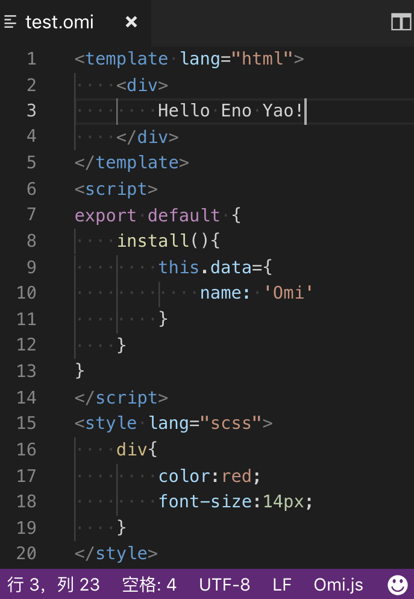

# Omi Snippets

Visual Studio Syntax highlighting for single-file [Omi.js](https://github.com/Tencent/omi) components (enabled by [omil](https://github.com/Wscats/omil)).

# Install

- Via Marketplace Control: search for `Omi Snippets`.
- Manual: clone this repo and install `vscode-omi-snippets.vsix` into your Visual Studio.

**NOTE:** You still need to install corresponding packages for pre-processors (e.g. JSX, SASS, TypeScript) to get proper syntax highlighting for them.

# Enabling JSX Highlighting

The `<script>` block uses the syntax highlighting currently active for you normal `.js` files. To support JSX highlighting inside Omi files, just set [Babel javascript highlighting package](https://packagecontrol.io/packages/Babel), which supports JSX, as your default JS highlighting. **Note you may need to explicitly disable Sublime's default `JavaScript` package to make it work.**

# License

[MIT](http://opensource.org/licenses/MIT)
